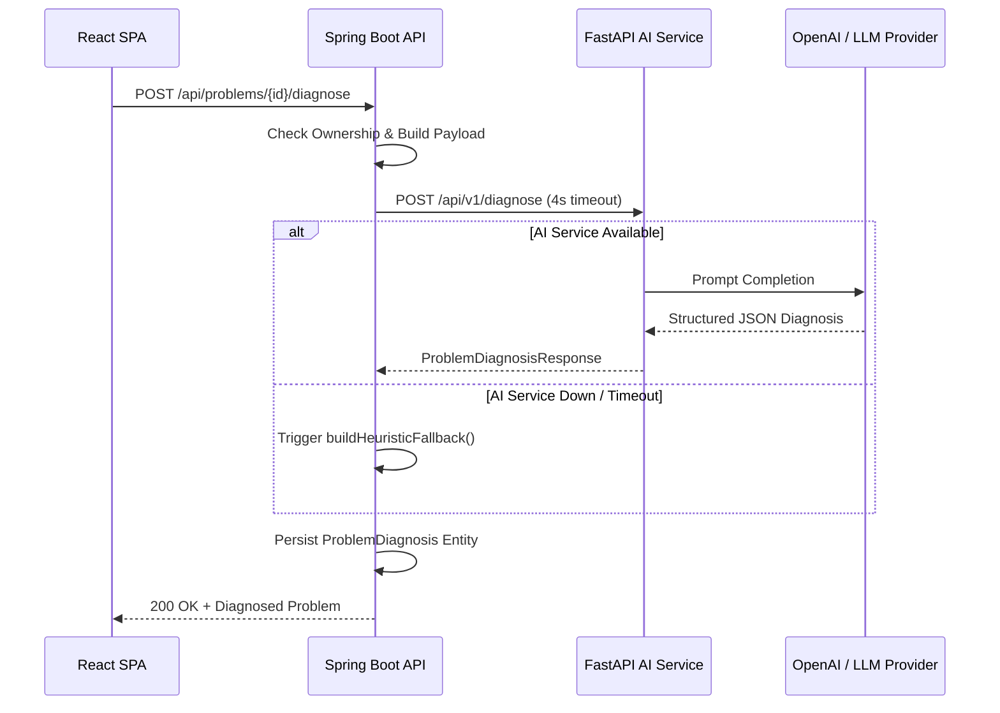
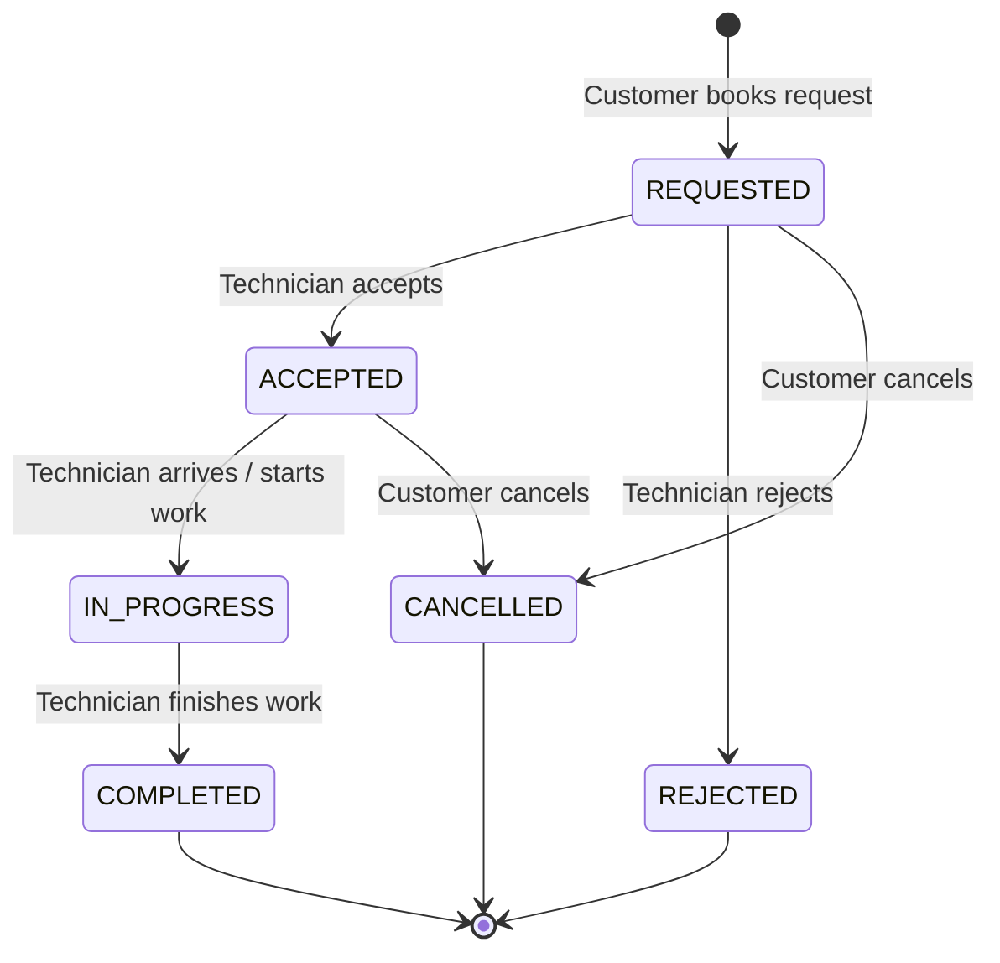
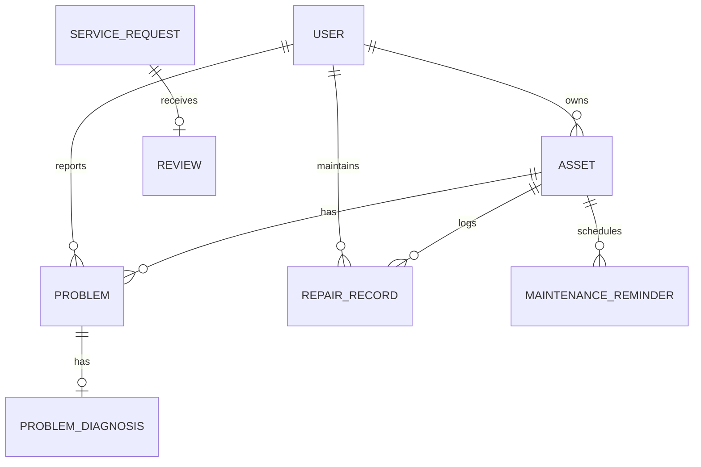

# 🎓 FixIt — Full-Stack Technical Interview Preparation Guide
## 15 Deep-Dive Questions & Production-Grade Answers Based on FixIt Architecture

This guide provides exhaustive, senior-level interview questions and structured answers directly based on the **FixIt** problem-resolution and maintenance platform. It is designed to prepare software engineers for system design, backend, frontend, security, and full-stack interviews.

---

### Table of Contents
1. [Question 1: Architectural Philosophy & Domain Separation](#q1-architectural-philosophy--domain-separation)
2. [Question 2: Decoupled AI Microservice Integration & Resilience](#q2-decoupled-ai-microservice-integration--resilience)
3. [Question 3: Safety Triage System Design & Heuristic Fallbacks](#q3-safety-triage-system-design--heuristic-fallbacks)
4. [Question 4: Role-Based Access Control (RBAC) & Stateless JWT Security](#q4-role-based-access-control-rbac--stateless-jwt-security)
5. [Question 5: Mitigating Insecure Direct Object References (IDOR)](#q5-mitigating-insecure-direct-object-references-idor)
6. [Question 6: State Machine Design for Service Request Bookings](#q6-state-machine-design-for-service-request-bookings)
7. [Question 7: Asset Management & Polymorphic Problem Association](#q7-asset-management--polymorphic-problem-association)
8. [Question 8: Financial Ledger Modeling: Spend Analytics & Estimated DIY Savings](#q8-financial-ledger-modeling-spend-analytics--estimated-diy-savings)
9. [Question 9: Automated Recurring Maintenance Engine Design](#q9-automated-recurring-maintenance-engine-design)
10. [Question 10: Event-Driven Lifecycle Notifications](#q10-event-driven-lifecycle-notifications)
11. [Question 11: Rating Aggregation & Concurrency Mitigation](#q11-rating-aggregation--concurrency-mitigation)
12. [Question 12: Content-Based Similar Problem Recommendation Engine](#q12-content-based-similar-problem-recommendation-engine)
13. [Question 13: Database Schema Design & Hibernate Mappings](#q13-database-schema-design--hibernate-mappings)
14. [Question 14: React Architecture: Protected Routes & Auth Token Injection](#q14-react-architecture-protected-routes--auth-token-injection)
15. [Question 15: Scalability, Production Readiness & Next Architectural Horizons](#q15-scalability-production-readiness--next-architectural-horizons)

---

### <a id="q1-architectural-philosophy--domain-separation"></a>Q1: Architectural Philosophy & Domain Separation
**Question:**
> *"How does FixIt structurally differ from a standard on-demand service marketplace (like TaskRabbit or Urban Company)? How does that affect your backend data models and user flow?"*

**Answer:**
A standard service marketplace treats the user journey as a simple transactional booking: *Select Service → Pick Time → Pay → Dispatch Worker*. This model fails when users are unsure of the true root cause, want to evaluate cost vs. risk, or desire to build self-reliance.

FixIt is designed around a **6-stage lifecycle engine**:
$$\text{Diagnose} \longrightarrow \text{Decide} \longrightarrow \text{Resolve} \longrightarrow \text{Learn} \longrightarrow \text{Remember} \longrightarrow \text{Prevent}$$

#### Data Model & Architecture Impacts:
1. **The First-Class Problem Entity (`Problem`)**:
   Instead of immediately booking a technician, the customer logs symptoms into a `Problem` entity with category, subcategory, and optional association to an owned physical device (`Asset`).
2. **Three-Way Resolution Branching**:
   The problem resolves through one of three pathways:
   - **DIY Self-Repair (`DiyGuide`)**: Guided interactive steps with safety protocols and tool checklists.
   - **Expert Mentorship (`LearningSession`)**: 1-on-1 virtual instruction with a master technician to learn how to fix it.
   - **Professional Dispatch (`ServiceRequest`)**: Certified technician service.
3. **The Lifelong Health Ledger (`RepairRecord`)**:
   Regardless of which resolution pathway is taken, completing the resolution writes a normalized entry into `RepairRecord`, linked to the user's `Asset`. This unlocks lifetime maintenance history, warranty tracking, cumulative spending analytics, and estimated DIY cost savings.
4. **Closing the Loop with Prevention (`MaintenanceReminder`)**:
   The platform shifts from reactive emergency repairs to proactive care, auto-scheduling recurring maintenance cycles (e.g., HVAC filters, thermal paste renewal).

---

### <a id="q2-decoupled-ai-microservice-integration--resilience"></a>Q2: Decoupled AI Microservice Integration & Resilience
**Question:**
> *"Why did you decouple the AI diagnosis service into a Python FastAPI microservice rather than calling an LLM directly from Spring Boot or React? How do you ensure high availability if the AI service fails?"*

**Answer:**
#### 1. Why Decouple from React?
Calling an LLM directly from the frontend exposes private API credentials (`OPENAI_API_KEY`) to the client browser, prevents server-side prompt enforcement, bypasses role authentication, and prevents saving diagnostic history to the relational database.

#### 2. Why Python FastAPI over Java Native?
- **Python Ecosystem Superiority**: Python has first-class native support for AI/ML frameworks (LangChain, LlamaIndex, Pydantic, HuggingFace, OpenAI SDKs).
- **Asynchronous Throughput**: FastAPI's async ASGI engine handles long-polling LLM streams with low memory footprint compared to JVM servlet worker threads.
- **Polyglot Service Boundary**: Data scientists and ML engineers can optimize prompt engineering and model fine-tuning independently from the core Java enterprise backend.

#### 3. High-Availability Resilient Fallback Pattern:
In `AiDiagnosisService.java`, communication with FastAPI uses Spring's `RestTemplate` configured with strict timeouts (4-second connect timeout, 6-second read timeout).

If the AI microservice times out, experiences a 5xx error, or is completely offline, `AiDiagnosisService` catches the exception and immediately invokes `buildHeuristicFallback(request)`. This rule-based diagnostic engine generates domain-specific hypotheses, recommended actions, and safety warnings so the user's flow is never blocked.



---

### <a id="q3-safety-triage-system-design--heuristic-fallbacks"></a>Q3: Safety Triage System Design & Heuristic Fallbacks
**Question:**
> *"In consumer repairs, DIY attempts on electrical, high-pressure plumbing, or automotive systems carry severe physical risk. How did you architect the safety triage system in FixIt?"*

**Answer:**
FixIt implements a **Safety-First Triage Engine** operating at two layers:

#### 1. Symptom & Domain Classification Rules:
Both the FastAPI `DiagnosisEngine` and the Spring Boot heuristic fallback enforce strict domain safety heuristics:
- **Electrical Work (`ELECTRICAL`)**:
  - High voltage (110V–240V), circuit breaker trips, or sparking immediately flag:
    `diySuitable = false`, `professionalRecommended = true`, `severity = HIGH / CRITICAL`.
  - Injected Warning: *"DANGER OF FATAL ELECTRIC SHOCK: High voltage present. Never touch exposed wiring or water near outlets."*
- **Combustible Gas & Water Heaters (`PLUMBING`)**:
  - Descriptions matching `gas`, `odor`, or `heater` trigger gas leak alerts:
    `diySuitable = false`, `professionalRecommended = true`.
  - Injected Warning: *"GAS HAZARD: If sulfur or rotten egg odor is detected, evacuate the premises immediately and contact utility services."*
- **Braking & Steering (`VEHICLE`)**:
  - Keywords matching `brake`, `steering`, or `engine stall` trigger road safety locks:
    `diySuitable = false`, `professionalRecommended = true`, `severity = CRITICAL`.
  - Injected Warning: *"CRITICAL VEHICLE SAFETY: Faulty brakes compromise public road safety. Do NOT operate vehicle at highway speeds."*

#### 2. UI Safety Enforcement:
In `ProblemDetails.jsx`, safety warnings are rendered in high-contrast red warning banners. If `professionalRecommended === true` and `diySuitable === false`, the DIY resolution card is locked or de-emphasized with a clear advisory recommending professional dispatch.

---

### <a id="q4-role-based-access-control-rbac--stateless-jwt-security"></a>Q4: Role-Based Access Control (RBAC) & Stateless JWT Security
**Question:**
> *"Walk me through FixIt's authentication and authorization architecture. How do JWT tokens encode roles, and how are route permissions enforced across both backend and frontend?"*

**Answer:**
FixIt uses a stateless token-based authentication architecture with four distinct roles: `CUSTOMER`, `TECHNICIAN`, `EXPERT`, and `ADMIN`.

#### 1. Token Lifecycle & Encoding:
- Passwords are salted and hashed using `BCryptPasswordEncoder` (10 rounds).
- Upon successful login via `POST /api/auth/login`, `JwtTokenProvider` signs an HMAC-SHA384 JWT containing claims:
  - `sub`: User email
  - `userId`: Database primary key
  - `role`: Role enum string (e.g. `CUSTOMER`)
  - `iat` / `exp`: 24-hour expiration timestamp.
- No sensitive data (like password hashes) is ever encoded in JWT claims or returned in DTOs.

#### 2. Backend Security Layer:
- `JwtAuthenticationFilter` intercepts each HTTP request, extracts the `Authorization: Bearer <token>` header, parses and cryptographically validates the token.
- It loads `UserDetails` via `CustomUserDetailsService` and constructs a `UsernamePasswordAuthenticationToken` with granted authority `ROLE_<ROLE>`.
- Method-level security is activated with `@EnableMethodSecurity(prePostEnabled = true)`.
- Critical endpoints are guarded using `@PreAuthorize`:
  - `hasRole('ADMIN')` on `AdminController` and `/api/admin/**`.
  - `hasRole('TECHNICIAN')` on technician status transitions.
  - `hasRole('EXPERT')` on session completions.
  - `hasRole('CUSTOMER')` on booking and review submissions.

#### 3. Frontend Protected Routes:
- `ProtectedRoute.jsx` checks the global `AuthContext`.
- If unauthenticated, it redirects to `/login` while preserving the intended destination (`state: { from: location }`).
- If `allowedRoles` is passed (e.g. `['ADMIN']`), it checks `user.role` and renders a clean unauthorized fallback if the role does not match.

---

### <a id="q5-mitigating-insecure-direct-object-references-idor"></a>Q5: Mitigating Insecure Direct Object References (IDOR)
**Question:**
> *"What is an Insecure Direct Object Reference (IDOR), and how do you guarantee that User A cannot read, modify, or delete User B's assets, problems, or service requests?"*

**Answer:**
#### What is IDOR?
An IDOR vulnerability occurs when an API endpoint accepts an object identifier (e.g. `PUT /api/assets/42` or `DELETE /api/problems/15`) and manipulates that database record without verifying whether the authenticated caller owns or has authorized access to that record.

#### How FixIt Guarantees IDOR Protection:
Rather than relying solely on path-level security, every service layer method in FixIt performs explicit tenant/ownership checks against the authenticated principal (`UserDetails.getUsername()`):

1. **Asset Management (`AssetService`)**:
   ```java
   Asset asset = assetRepository.findById(id).orElseThrow(...);
   if (!asset.getOwner().getEmail().equalsIgnoreCase(userEmail)) {
       throw new ApiException(HttpStatus.FORBIDDEN, "Only the owner can modify this asset");
   }
   ```
2. **Cross-Entity Association Validation**:
   When a user creates a problem or service request and references an existing `assetId`, `ProblemService` checks:
   ```java
   if (!asset.getOwner().getEmail().equalsIgnoreCase(userEmail)) {
       throw new ApiException(HttpStatus.FORBIDDEN, "You cannot associate a problem with an asset you do not own");
   }
   ```
   This prevents User A from maliciously linking their problem to User B's private hardware.
3. **Multi-Party Service Verification (`ServiceRequestService`)**:
   For `ServiceRequest`:
   - Reading: caller must be the customer, the assigned technician, or an admin.
   - Modifying status (accept, start, complete): verified by `findAndVerifyTechnician(id, technicianEmail)`.
   - Canceling: caller must be `sr.getCustomer()`.

---

### <a id="q6-state-machine-design-for-service-request-bookings"></a>Q6: State Machine Design for Service Request Bookings
**Question:**
> *"How did you design the lifecycle state machine for `ServiceRequest`? What prevents illegal transitions like completing an unaccepted job or cancelling a completed job?"*

**Answer:**
The service booking lifecycle is modeled as a deterministic finite state machine with strict legal transition paths:



#### Enforcement Mechanism:
In `ServiceRequestService.java`, each transition method validates the exact current status before executing the state change:
- `acceptRequest`: throws `400 BAD_REQUEST` unless `status == REQUESTED`.
- `startRequest`: throws `400 BAD_REQUEST` unless `status == ACCEPTED`.
- `completeRequest`: throws `400 BAD_REQUEST` unless `status == IN_PROGRESS`.
- `cancelRequest`: throws `400 BAD_REQUEST` if `status` is already `IN_PROGRESS` or `COMPLETED`.

#### Cascading Side Effects:
When `completeRequest` succeeds within an atomic `@Transactional` boundary:
1. `ServiceRequest.status` becomes `COMPLETED`.
2. The linked `Problem.status` is automatically updated to `RESOLVED`.
3. A `RepairRecord` is created in the item's ledger with final cost and warranty days.
4. A notification is dispatched inviting the customer to submit a review.

---

### <a id="q7-asset-management--polymorphic-problem-association"></a>Q7: Asset Management & Polymorphic Problem Association
**Question:**
> *"Explain the relationship between `User`, `Asset`, `Problem`, and `RepairRecord`. Why can a Problem exist without an Asset, but an Asset can track multiple Problems and Repairs?"*

**Answer:**
#### The Domain Rationale:
In the real world, a user may experience a problem with a non-registered or generic item (e.g. "Clogged bathroom sink", "Squeaking garage door hinge") where registering an asset first would add unwanted friction. Thus:
- `Problem.asset` is optional (`nullable = true`).

However, for valuable equipment (laptops, washing machines, cars, smartphones), registering an `Asset` unlocks aggregate health analytics.

#### Entity Relationship Modeling:


- `User` $\to$ **1:N** `Asset` (`owner_id`)
- `Asset` $\to$ **1:N** `Problem` (`asset_id` nullable)
- `Asset` $\to$ **1:N** `RepairRecord` (`asset_id` nullable)
- `Asset` $\to$ **1:N** `MaintenanceReminder` (`asset_id` nullable)

In `AssetResponse.java`, we calculate `problemCount` using `problemRepository.countByAssetId(asset.getId())`. This gives users instant visibility into chronic device failure rates without executing N+1 queries.

---

### <a id="q8-financial-ledger-modeling-spend-analytics--estimated-diy-savings"></a>Q8: Financial Ledger Modeling: Spend Analytics & Estimated DIY Savings
**Question:**
> *"How do you calculate cumulative repair spending and estimated DIY savings in `RepairRecordService`? How does this incentivize users?"*

**Answer:**
#### 1. Gamifying Mechanical Self-Reliance:
Traditional platforms only highlight money spent. FixIt actively calculates **Estimated DIY Savings** to reward users for completing DIY guides and expert mentorship sessions rather than paying commercial contractor dispatch rates.

#### 2. Calculation Formula:
In `RepairRecordService.getStats(email)`:
$$\text{Total Spent} = \sum \text{RepairRecord.cost}$$
$$\text{Estimated Baseline Dispatch Cost} = \text{DIY Count} \times \$120.00$$
$$\text{Estimated Savings} = \max(0, \text{Estimated Baseline Dispatch Cost} - \text{Total Spent})$$

#### 3. Execution Mechanics:
- When a user finishes a `DiyGuide`, `DiyGuideService.completeGuide` logs a `RepairRecord` with `cost = 0.0` and `ResolutionType.DIY_GUIDE`.
- When an expert guided session finishes, `cost = sessionPrice` (e.g. $35).
- When a technician finishes, `cost = finalCost` (e.g. $165).
The resulting `RepairStatsResponse` exposes `totalRepairs`, `totalSpent`, `estimatedSavings`, and a breakdown by resolution type (`DIY_GUIDE`, `EXPERT_SESSION`, `TECHNICIAN_SERVICE`).

---

### <a id="q9-automated-recurring-maintenance-engine-design"></a>Q9: Automated Recurring Maintenance Engine Design
**Question:**
> *"How does the recurring maintenance reminder engine work? How do you prevent missed reminders and calculate subsequent due dates?"*

**Answer:**
#### The Problem:
Many preventative tasks (e.g. cleaning refrigerator condenser coils every 180 days, replacing HVAC air filters every 90 days) require recurring cadence. If a user marks an item complete, they shouldn't have to manually create the next task.

#### The Architectural Solution:
1. `MaintenanceReminder` contains:
   - `dueDate` (Instant)
   - `recurrenceDays` (Integer, nullable)
   - `status` (`PENDING`, `COMPLETED`, `OVERDUE`)
2. In `MaintenanceReminderService.completeReminder`:
   - The current reminder is marked `COMPLETED` with `completedAt = Instant.now()`.
   - If `recurrenceDays != null && recurrenceDays > 0`:
     $$\text{Next Due Date} = \text{Instant.now()} + \text{recurrenceDays} \times 1\text{ day}$$
   - A new `MaintenanceReminder` is automatically persisted with `status = PENDING`.
   - An in-app `Notification` is sent to the user: *"Completed 'Replace AC Filter'. Next reminder scheduled for YYYY-MM-DD"*.

---

### <a id="q10-event-driven-lifecycle-notifications"></a>Q10: Event-Driven Lifecycle Notifications
**Question:**
> *"Explain how notifications are generated across the platform and consumed by the React UI."*

**Answer:**
#### 1. In-App Notification Center:
Rather than requiring third-party messaging infrastructure during initial phases, FixIt provides an internal notification ledger via the `Notification` entity:
- `recipient`: `User` foreign key
- `title`, `message`, `link` (frontend route, e.g. `/service-requests`)
- `notificationType`: `SERVICE_UPDATE`, `DIAGNOSIS_READY`, `MAINTENANCE_DUE`, `REVIEW_RECEIVED`, `REPAIR_COMPLETED`, `SYSTEM`
- `isRead`: boolean flag with indexed queries.

#### 2. Triggering Points:
- Technician assigned $\to$ technician notified.
- Technician accepts/starts $\to$ customer notified.
- Service completed $\to$ customer notified with review prompt.
- Review submitted $\to$ technician notified with star rating.
- Recurring task completed $\to$ next maintenance reminder alert created.

#### 3. Frontend Consumption:
`NotificationBell.jsx` in the global navbar polls `GET /api/notifications/unread-count` and displays an active badge. Clicking reveals a dropdown of recent alerts, allowing users to jump directly to the relevant view and mark alerts as read.

---

### <a id="q11-rating-aggregation--concurrency-mitigation"></a>Q11: Rating Aggregation & Concurrency Mitigation
**Question:**
> *"How are technician ratings calculated in `ReviewService`? How do you prevent double reviews and ensure aggregate ratings stay accurate?"*

**Answer:**
#### 1. Idempotency & Abuse Prevention:
In `ReviewService.createServiceReview`:
- **Eligibility Check**: Verified that `serviceRequest.status == COMPLETED` and `serviceRequest.customer.id == customer.id`.
- **Single-Review Guarantee**: `reviewRepository.existsByServiceRequestId(sr.getId())`. If true, throws `400 BAD_REQUEST`.

#### 2. Aggregate Rating Computation:
In `ReviewRepository`:
```sql
@Query("SELECT AVG(r.rating) FROM Review r WHERE r.targetUser.id = :userId")
Double calculateAverageRating(@Param("userId") Long userId);
```
Upon saving a review, `ReviewService`:
1. Executes `calculateAverageRating(technician.getId())`.
2. Counts total reviews via `countByTargetUserId(technician.getId())`.
3. Updates `TechnicianProfile.averageRating` and `TechnicianProfile.reviewCount` in the same transaction.
This denormalization ensures that searching technicians (`GET /api/technicians`) never performs expensive aggregate join queries across thousands of historical reviews.

---

### <a id="q12-content-based-similar-problem-recommendation-engine"></a>Q12: Content-Based Similar Problem Recommendation Engine
**Question:**
> *"How does `getSimilarProblems` identify related issues in the same domain without relying on an external vector database?"*

**Answer:**
In `ProblemService.getSimilarProblems(Long id)`:
1. It fetches candidate problems within the same `ProblemCategory`.
2. It tokenizes the target problem's title into keyword tokens ($\text{length} > 3$ to eliminate common stop-words like "and", "the", "with").
3. It performs keyword frequency matching against candidate titles and descriptions:
   ```java
   long matches = Arrays.stream(keywords)
       .filter(k -> k.length() > 3 && (p.getTitle().toLowerCase().contains(k) 
                                    || p.getDescription().toLowerCase().contains(k)))
       .count();
   ```
4. It sorts candidates by match count descending and returns the top 4 similar problems.
5. In `ProblemDetails.jsx`, the user sees how previous users tackled similar issues, providing immediate context before they choose a resolution path.

---

### <a id="q13-database-schema-design--hibernate-mappings"></a>Q13: Database Schema Design & Hibernate Mappings
**Question:**
> *"What JPA relationships and cascade behaviors did you configure, and how did you prevent infinite JSON serialization recursion?"*

**Answer:**
#### 1. Bidirectional Relationships & Jackson Recursion:
In bidirectional JPA entities (e.g. `User` $\leftrightarrow$ `Problem`, `Problem` $\leftrightarrow$ `ProblemDiagnosis`), serializing the entity directly causes infinite JSON recursion (`StackOverflowError`).
**FixIt Solution**:
Entities are **never returned directly from Spring controllers**. All controller endpoints map entities to immutable Data Transfer Objects (`ProblemResponse`, `AssetResponse`, `UserResponse`, etc.) using explicit static factories (`ProblemResponse.fromEntity(problem)`). This ensures:
- 0 risk of JSON recursion loops.
- Sensitive fields (`passwordHash`) are never leaked.
- Domain internals are decoupled from the public REST API contract.

#### 2. DDL Auto & Profile Strategy:
- **Production (`application.yml`)**: PostgreSQL driver, `ddl-auto: update`, HikariCP connection pooling.
- **Automated Testing (`application-local.yml`)**: In-memory H2 database with `H2Dialect` and `ddl-auto: create-drop` for rapid, hermetic test execution.

---

### <a id="q14-react-architecture-protected-routes--auth-token-injection"></a>Q14: React Architecture: Protected Routes & Auth Token Injection
**Question:**
> *"How does the React frontend maintain authentication state across page reloads, and how are JWT tokens injected into outgoing HTTP requests?"*

**Answer:**
#### 1. Token Persistence & Initialization:
- In `AuthContext.jsx`, tokens and user profiles are stored in `localStorage` (`fixit_token`, `fixit_user`).
- On app mount, `AuthContext` initializes state synchronously from `localStorage`, preventing auth flicker on page reloads.

#### 2. Axios Request Interceptor:
In `services/apiClient.js`:
```javascript
apiClient.interceptors.request.use((config) => {
  const token = localStorage.getItem('fixit_token');
  if (token) {
    config.headers.Authorization = `Bearer ${token}`;
  }
  return config;
});
```
Every outgoing API request automatically carries the `Authorization: Bearer <token>` header without needing manual injection in components.

#### 3. Response Interceptor (Automatic 401 Eviction):
```javascript
apiClient.interceptors.response.use(
  (response) => response,
  (error) => {
    if (error.response?.status === 401) {
      localStorage.removeItem('fixit_token');
      localStorage.removeItem('fixit_user');
      window.location.href = '/login';
    }
    return Promise.reject(error);
  }
);
```
If a token expires, the client clears stored credentials and redirects to login cleanly.

---

### <a id="q15-scalability-production-readiness--next-architectural-horizons"></a>Q15: Scalability, Production Readiness & Next Architectural Horizons
**Question:**
> *"If FixIt scales to 500,000 monthly active users and 50,000 daily service requests, what architectural bottlenecks would emerge and how would you resolve them?"*

**Answer:**
#### 1. Database Read/Write Scaling:
- **Read Replicas**: Separate transactional writes from reporting queries (`PlatformMetricsResponse`, catalog browsing).
- **PostgreSQL Partitioning**: Partition `repair_records` and `service_requests` tables by year/month.
- **Indexes**: Composite index on `(user_id, repaired_at DESC)` and `(technician_id, status)`.

#### 2. Asynchronous Event Bus (Kafka / RabbitMQ):
Currently, `ServiceRequestService` invokes `NotificationService` and `RepairRecordService` synchronously within the HTTP request transaction.
At scale:
- Publish domain events (`ServiceRequestCompletedEvent`, `ReviewSubmittedEvent`) to an Apache Kafka or RabbitMQ event topic.
- Background consumer workers handle notification dispatch, email/SMS triggers, and analytics calculation without blocking the HTTP response.

#### 3. Caching Layer (Redis):
- Cache static catalogs: DIY guides, verified technician search lists, and expert profiles with a 15-minute TTL.
- Cache user session claims and invalidation tokens for instant revocation.

#### 4. Semantic AI Vector Search (pgvector):
- Upgrade `getSimilarProblems` from keyword token matching to semantic vector embeddings using `pgvector` or Qdrant.
- Convert problem titles and descriptions into dense vector embeddings (e.g. OpenAI `text-embedding-3-small`) to surface semantically identical problems regardless of user wording differences.
